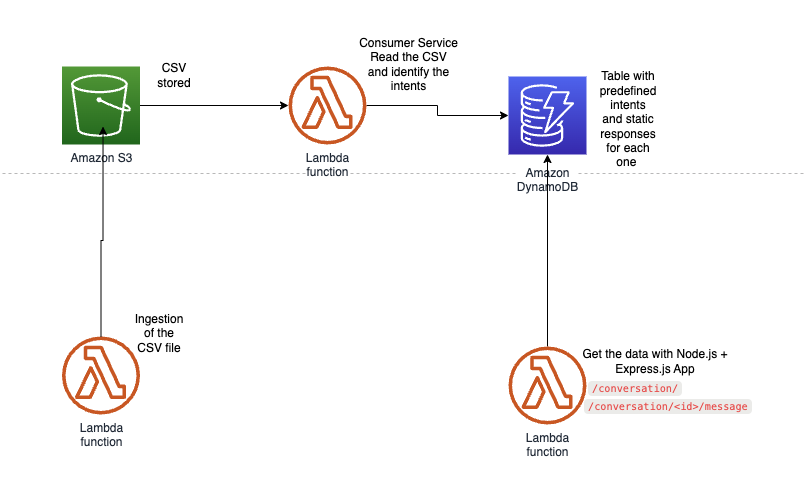

# Ingest CSV Lambda Function | Serverless Framework Node Express API on AWS

Node Express API service running on AWS Lambda using the traditional Serverless Framework.



## Usage

### Deployment

Install dependencies with:

```
npm install
```

and then deploy with:

```
serverless deploy
```

After running deploy, you should see output similar to:

```bash
Deploying aws-node-express-api-project to stage dev (us-east-1)

✔ Service deployed to stack aws-node-express-api-project-dev (196s)

endpoint: ANY - https://xxxxxxxxxx.execute-api.us-east-1.amazonaws.com
functions:
  api: aws-node-express-api-project-dev-api (766 kB)
```
