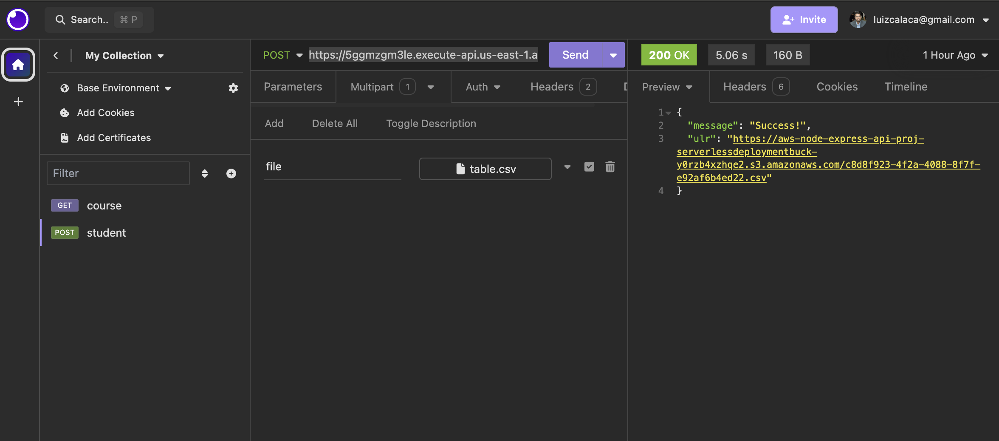

# Ingest CSV Lambda Function | Serverless Framework Node Express API on AWS

Node Express API service running on AWS Lambda using the traditional Serverless Framework.


## Usage

### 1 - We can send a CSV file using the first lambda function:

`https://5ggmzgm3le.execute-api.us-east-1.amazonaws.com/upload``



### 2 - The second lambda function to get the intents and others processing will be triggered after get a CSV file from a S3 bucket, here it is: https://github.com/luizcalaca/aws-typescript-project-read-csv-ai

### 3 - The third lambda function we could get the conversations paginated, and it is still in development.

### Deployment

Install dependencies with:

```
npm install
```

and then deploy with:

```
serverless deploy
```

After running deploy, you should see output similar to:

```bash
Deploying aws-node-express-api-project to stage dev (us-east-1)

✔ Service deployed to stack aws-node-express-api-project-dev (196s)

endpoint: ANY - https://xxxxxxxxxx.execute-api.us-east-1.amazonaws.com
functions:
  api: aws-node-express-api-project-dev-api (766 kB)
```
